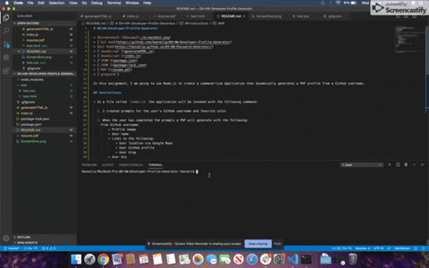

# 09-HW-Developer-Profile-Generator

* [Screenshot] 
* [`Git Hub](https://github.com/hannalip/09-HW-Developer-Profile-Generator)
* [`JavaScript`](generateHTML.js)
* [`JavaScript`](index.js)
* [`JSON`](package.json)
* [`JSON`](package-lock.json)
* [`PDF`](resume.pdf)
* [`gitgnore`]

In this assignment, I am going to use Node.js to create a command-line application that dynamically generates a PDF profile from a GitHub username.

## Instructions

* In a file called `index.js` the application will be invoked with the following command:

  1. I created prompts for the user's GitHub username and favorite color

  2. When the user has completed the prompts a PDF will generate with the following:
  - From Github username:
        * Profile image
        * User name
        * Links to the following:
            * User location via Google Maps
            * User GitHub profile
            * User blog
        * User bio
        * Number of public repositories
        * Number of followers
        * Number of GitHub stars
        * Number of users following
    - From favorite color:
        * Color will be used as the background color for cards

### Packages
* axios 
* html5-to-pdf
* inquirer

### Site Demo

* **NOTE:** The two files below were provided with CSS and starter code.
* [`JavaScript`](generateHTML.js)
* [`JavaScript`](index.js)